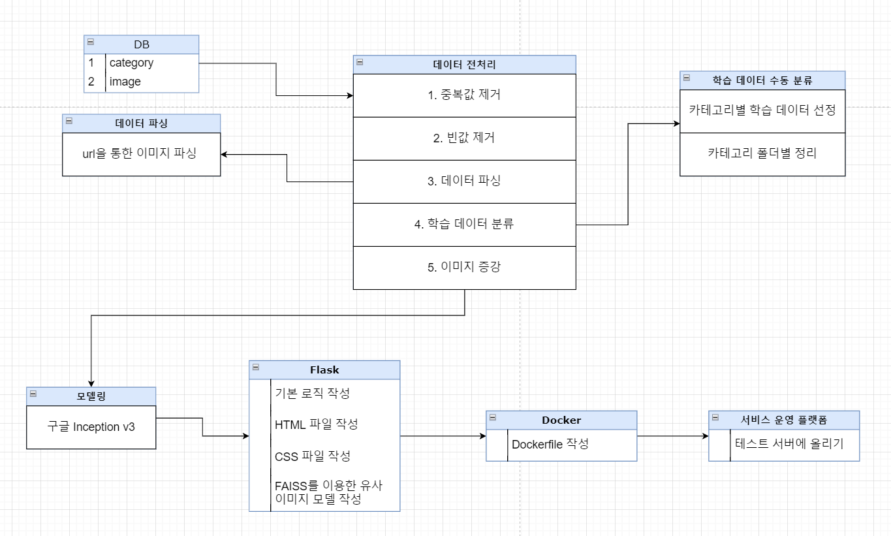
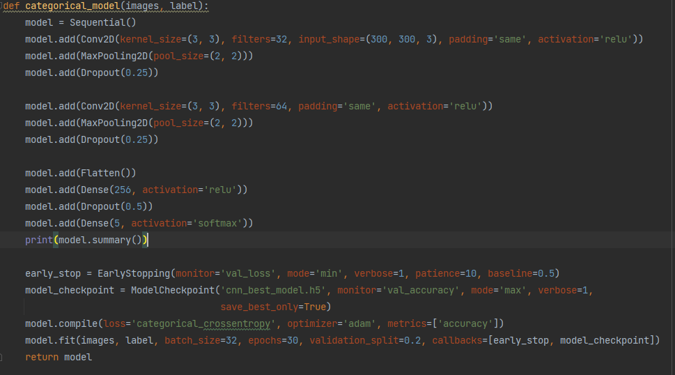
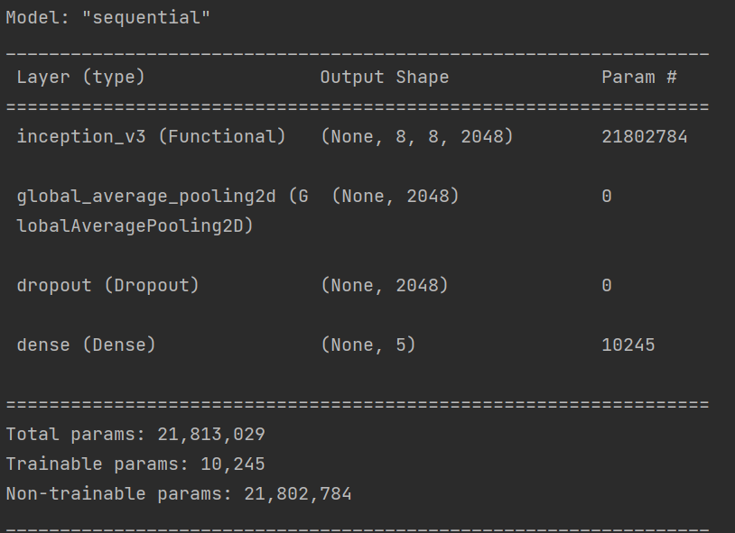
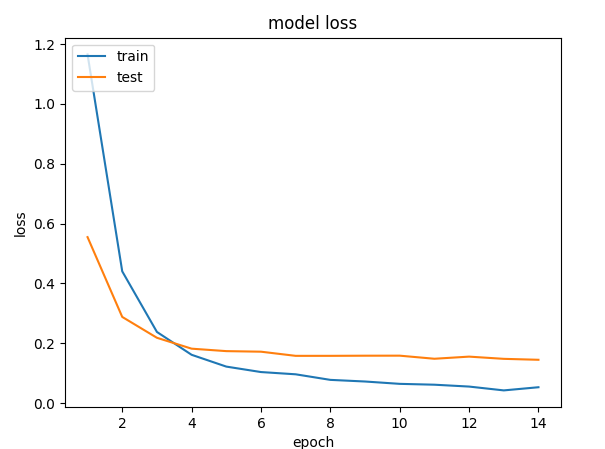
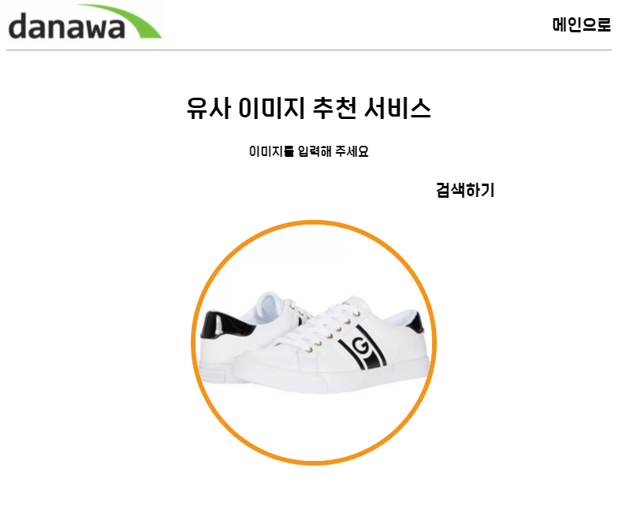
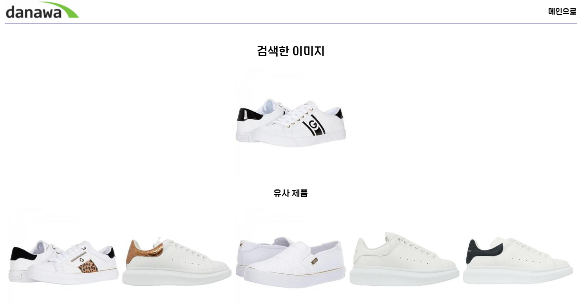

# Image

이미지 카테고리 분류 및 유사이미지 추천 프로젝트

## 이미지 전처리

- DB에 있는 이미지 중 흰색 배경에 의류 이미지가 나온 사진으로 학습 데이터 생성
- 데모 버전으로 5개의 카테고리(가방, 신발, 바지, 후드, 맨투맨(+티셔츠))와 500개 정도의 이미지 데이터를 가지고 진행하였습니다.
- 이미지가 많지 않기 때문에 ImageGenerator를 이용한 이미지 증강을 통해 학습데이터를 늘렸습니다.

## 모델

### 1. 기존 CNN 모델

### 2. 인셉션 모델

#### 2-1) 모델 정확도

### 3. history

#### 3-1) loss율

#### 3-2) 정확도

## FAISS

- facebook에서 만든 vector 유사도를 효율적으로 측정하는 라이브러리
- numpy나 scikit-learn에서 제공하는 코사인 유사도(cosine similarity)보다 빠르고 강력하다.
- 코드 내 적용
  - (299, 299, 3)의 3d array를 299 * 299 * 3 의 벡터형태로 변환 한 뒤
  - 벡터와 벡터사이의 유사도를 측정하여 거리와 인덱스를 반환

## 화면 구성

- 메인 페이지

- 예측 사진 입력 페이지

- 예측 결과 페이지

